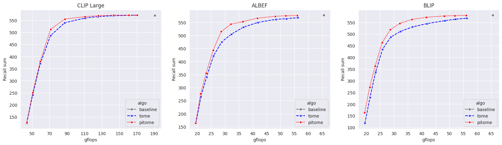
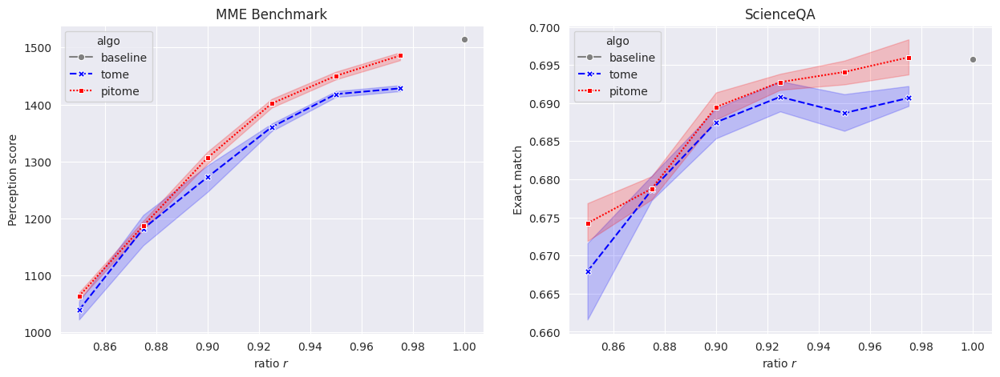
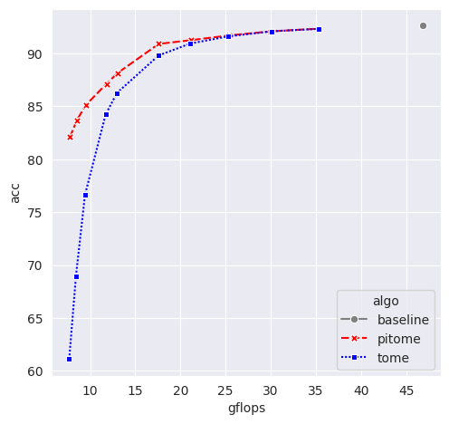

# Compare to ToMe

To better demonstrate the significant performance gains of PiToMe compared to ToMe, we have included several figures for each task across a wider range of ratios $r$. A consistent pattern emerges across all tasks: as long as we don't reduce more than 60% of GFlops, PiToMe significantly outperforms ToMe, with the margin of improvement increasing as the ratio $r$ decreases.
## 1.Image-text retrieval
Performance of of PiToMe versus token when applied to CLIP-large , ALBEF and BLIP and run on Flickr30k. 

In The figure above it can easy be seen that the performance gap between ToME and PiToMe grow larger as we reduce $r$ (lower gflops). 

## 2.Visual Question Answering with LLaVA
To better demonstrate the stregth on PiToMe in generative task like VQA. We have run LLava-7B 7 times on two dataset MME benchmark and ScienceQA. 

It is clear that apart from better perfomance, PiToME achieve much stable accuracy compare to ToMe which is demonstrated as lower std at each ratio $r$. Note that, LLaVa used CLIP-L checkpoint with 24 layers, so here if we used $r=0.95$, the compression rate for ViT will reach 0.56%, which mean nearly halves, and PiToMe can still perserve approx 98% performance of LLaVA or even outperform baseline a little in ScieneQA.

## 3.Text Classification

In Text classification task, PiToMe offer much better trade off Here, PiToMe can compress more than 60% number of tokens while stil achive accuracy above 90% (about 2% drop) and even more than 80% number of tokens while still being able to achieve above 85% in accuracy.

## 4.Image classification
##### DeiT
|gflops | PiToMe| ToMe|
|----------|----------|----------|
|  | |  |
|  | |  |
|  ||  |
|  ||  |
|  ||  |
##### MAE 
|gflops | PiToMe| ToMe|
|----------|----------|----------|
|  | |  |
|  | |  |
|  ||  |
|  ||  |
|  ||  |