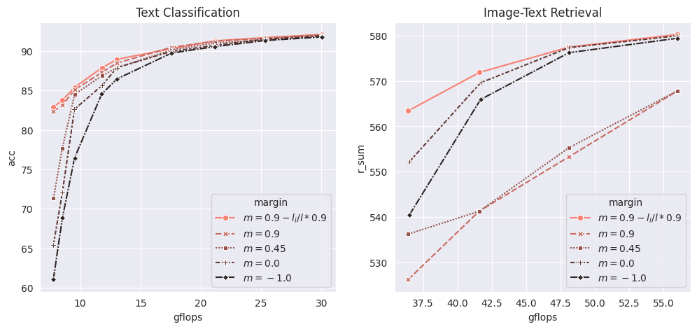

# Ablation study
Recall the equation to calcular energy score for each token: 

$$
 E_i(v_i,W[i,:]) = \frac{1}{N} \sum_{j \in \mathcal{N}(i)}  {f}_m(\cos(v_i,v_j)), \text{ } {f}_m(x) = \begin{cases}
            x  & \text{ if }  x \geq m \\
            \alpha(\exp(x-m) - 1) & \text{otherwise}
        \end{cases}. 
$$
Here there are two most impotant parameters:
- Margin $m$, which is set to $m=0.9 - 0.9 * l_i/l$ where $l_i$ is the current layer index, and $l$ is the number of layer
- Lowerbound $\alpha$, which is set to $\alpha=1.0$

### 1. Margin $m$ 
<!-- In our paper, $m$ is a crucial parameter that determines the radius around each token, selectively considering nearby neighbors and discarding the influence of distant clusters on the energy score of each token.  -->
To thoroughly understand how the parameter $m$ affects PiToMe's accuracy, we conducted several experiments with varying $m$ settings. We tested both the adaptive version, where $m$ is calculated as $0.9 - 0.9 \cdot l_i/l$, and the fixed version with $m$ values of $0.9$, $0.45$, $0.0$, and $-1.0$. In this context, larger $m$ values indicate a tighter margin, while $m = -1.0$ means there is no margin at all, causing each token to consider all other tokens equally.

Here it can be seen that, in both task, the adative version $m=0.9 - 0.9 \cdot l_i/l$ achieve best results. While models with fixed $m$ tend to have the accuracy drop sharply when $r$ is lower than some threshold. The reason might be as the token space become more spare in deeper layers, PiToMe fixed $m$ will likely to assign the same energy score to every tokens which is undesireable since we want to idenify isolated token to protect them while merging the others. 

## 2. Lowerbound $\alpha$ 

Recall that we used $\alpha(\exp(x-m) - 1)$ to smoothen the $f_m(\cdot)$ function to consider neighbour tokens that lie close to the margin $m$. The larger $\alpha$ the more consideraton for these neighbours, and $\alpha=0$ also mean we completely ignore them. As shown below, we also tested then on image-text retrieval and text classifcation task, where $\alpha > 0$ does have positive influence on the performance of the model.  
##### Image-text retrieval
| | $\alpha=1.0$ | $\alpha=0.5$ | $\alpha=-1.0$|
|----------|----------|----------|----------|
| $r=0.85$ | 519.98 | 518.66 |545.9|
| $r=0.875$ | 545.9 | 544.22 |542.54|
| $r=0.9$ |562.82 | 562.42| 561.92|
| $r=0.925$ | 571.88| 571.1 | 570.62 |
| $r=0.95$ | 577.5 | 577.43 | 577.4 |
| $r=0.975$ | 580.24 | 579.82| 579.76|

##### Text classification 

|  | $\alpha=1.0$ | $\alpha=0.5$ | $\alpha=0.0$|
|----------|----------|----------|----------|
| $r=0.55$ | 85.5| 84.04| 83.23 |
| $r=0.6$ | 87.77| 87.11 | 87.13|
| $r=0.65$ | 89.15| 88.89 | 88.16 |
| $r=0.7$ | 90.33| 90.03 | 89.71 |
| $r=0.75$ |91.27| 91.26 | 91.24 |
| $r=0.8$ | 91.78 | 91.75| 91.72 |
| $r=0.85$ | 92.00 | 91.98 | 91.70 |
| $r=0.9$ | 92.24 | 92.10 | 91.98 |

